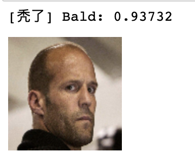
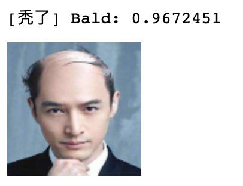
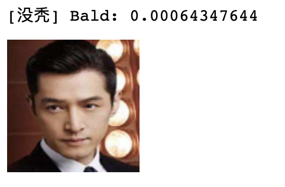

### 秃头识别 Bald Classification

一个秃头识别的模型，可以识别图片中的人物是否存在秃头

训练数据集基于Kaggle上的Bald Classification Dataset。

模型大小在1.8M左右。

需要安装TensorFlow+keras

克隆项目后执行predict.py即可测试

    python predict.py

[数据集下载地址](https://hyper.ai/datasets/12385)